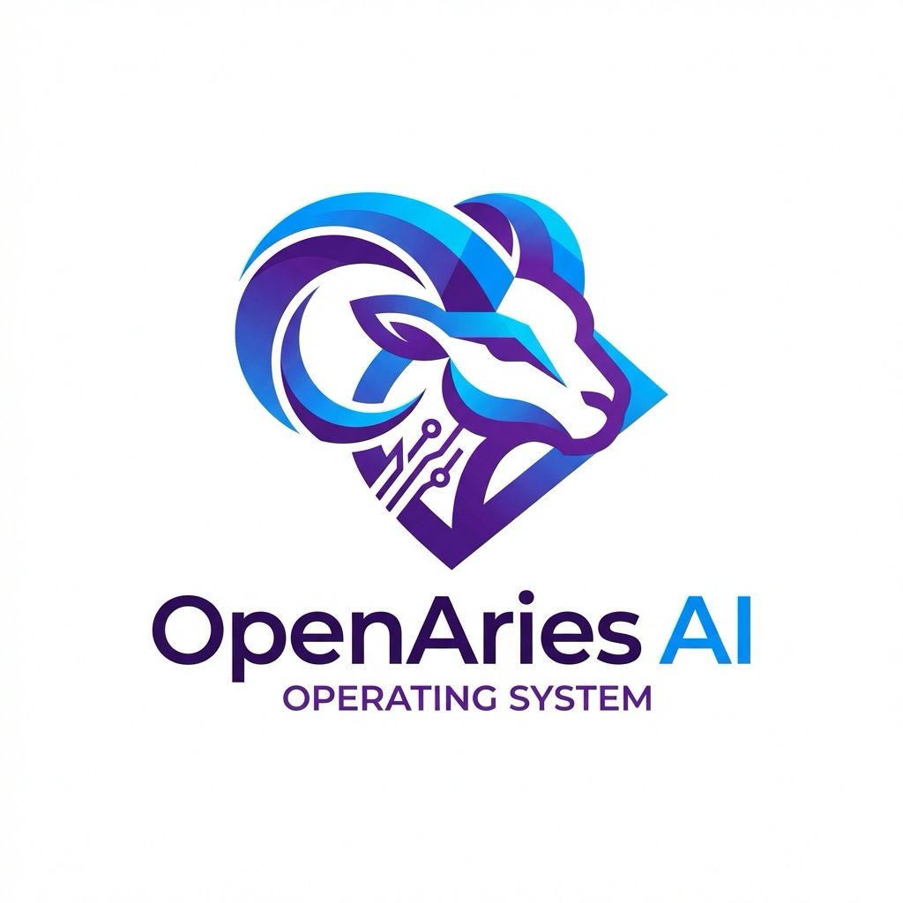

# AIOS (Open Aries)
<div align="center">


[](#)
[](#)
[](#)
[](#)
[](LICENSE)
[](#)
</div>

A research operating system whose soul is **formal verification**. AIOS is a **gVisor-style
userspace kernel**: programs compile for the **AIOS ABI** and never see the host; their syscalls are
*trapped* and serviced by the AIOS kernel, which reaches the machine only through a narrow
**Platform Abstraction Layer (PAL)** — the host/HAL seam. Linux is the interim substrate today;
**a verified seL4 (x86-64) is the destination.** Swap the host underneath and the programs — and the
entire AIOS kernel above the PAL — do not change.

> **Field note (Bryan):** Major pivot ongoing — I hit a brick wall. 0.4.x was built on seL4; 0.5.x is
> being re-baselined for Linux as a HAL kernel. I hit a ~32-second Arm-core stall on seL4 from
> still-unknown issues and gave up on that path. The cool bit: this is the first major re-pivot off
> the core kernel — and it should (knock on wood) be transportable.

> **Active line: `v0.5.x`** — the userspace kernel, in the `uk/` tree (`uk/include/aios_version.h`).
> **We are holding at 0.5.x while we explore and mature the Linux-based HAL** (the PAL's Linux
> backend) before advancing the roadmap.
>
> **Prior line: `v0.4.x`** — the seL4/RPi4 bare-metal microkernel, on `main` (`include/aios/version.h`).
> Preserved as the record + fallback, and the source of the userspace personality that transfers.

---

## The pivot (2026): why AIOS moved off bare-metal seL4

For many milestones AIOS was a from-scratch OS on **seL4 on the Raspberry Pi 4** — and it got
remarkably far (standalone HDMI + USB console, a hand-written GPU driver, 4-core SMP, an isolated
network process, TCC self-hosting, a 55/55 POSIX core; see *The 0.4.x seL4 line* below). But a
hard truth emerged from our own analysis:

- **seL4's verification guarantee is not realized on the RPi4.** The proofs are uniprocessor, and
  the RPi4 is not a verified platform. So we were paying *all* of seL4's costs — porting every
  driver by hand, fighting a ~32.4 s idle-teardown stall, chasing MSI/DMA/USB-hub quirks — and
  collecting *none* of its benefit.
- The microcosm: this era's last hardware lead proved the brcmstb GT_4GB MSI programming *correct*
  on silicon, yet still couldn't be validated because the USB hub wouldn't deliver a keystroke.
  **Linux solves all of that for free.**

**The decision (Bryan):** re-base AIOS as a userspace kernel. **Linux = a pragmatic interim
substrate** (mature drivers, no stall, get operational fast). **A verified seL4 on x86-64 = the
destination** — because verification is the soul of the project. The architecture is built to
*replant* onto seL4 later, behind a strict seam, so nothing above the PAL has to change.

`0.5.x` is therefore a deliberate new design line, not a continuation of `0.4.x`. The seL4 tree is
intact on `main`; its real value — the shell, fs semantics, the net/pipe/exec model, the POSIX
personality — is exactly what the userspace kernel inherits.

## The model

```
        AIOS programs   (compiled for the AIOS ABI — host-agnostic, unmodified across hosts)
              │   syscall instruction (TRAPPED; the program thinks AIOS IS the kernel)
   ┌──────────▼────────────────────────────────────────────┐
   │  AIOS userspace kernel   (the stable, portable core)    │   ← the future verified TCB
   │  ABI dispatch · VFS · process/exec · pipe/IPC · …        │
   └──────────┬────────────────────────────────────────────┘
              │  PAL — the narrow platform/HAL seam (the future verified boundary)
   ┌──────────▼─────────────┐               ┌────────────────────────────┐
   │  PAL → Linux  (NOW)     │      or       │  PAL → seL4 (DESTINATION)   │
   │  trap: ptrace            │               │  trap: VMM / fault handler  │
   │  hw:   Linux drivers     │               │  hw:   device untyped + IRQ │
   │  sched: sched_ext (BPF)  │               │  sched: seL4 sched config   │
   └──────────────────────────┘               └────────────────────────────┘
```

The defining property: **programs only ever see AIOS's ABI.** The host kernel is an implementation
detail of the PAL. The AIOS kernel (`uk/kernel/aios_kernel.c`) includes *only* AIOS-owned headers —
never a host header — so it is host-agnostic by construction. The only host-aware file is the PAL
backend (`uk/pal/pal_linux.c`). Today that backend is a `ptrace(PTRACE_SYSCALL)` driver; a future
`pal_sel4.c` implements the same contract via seL4 virtualization. **Keeping the PAL narrow is the
whole game** — every primitive added there is future proof obligation.

Design detail: [docs/DESIGN_20260624_aios_userspace_kernel_on_linux.md](docs/DESIGN_20260624_aios_userspace_kernel_on_linux.md) ·
tree overview: [uk/README.md](uk/README.md).

## Status — v0.5.x, exploring the Linux HAL

The `uk/` tree is a working userspace kernel. Everything below is validated **in a Linux container
(colima) AND natively on a real Raspberry Pi 4 running Linux** (the same board that used to run
AIOS-on-bare-metal now boots stock Raspberry Pi OS — the hardware just works).

- **M0 — Linux substrate.** The RPi4 boots mainline Linux; every device we hand-fought on seL4
  (USB keyboard through the VL805 hub, GENET, V3D, 4 cores) works out of the box.
- **M1 — first light.** A trivial AIOS-ABI program's syscalls are *trapped* and serviced by the AIOS
  kernel (AIOS syscall numbers are disjoint from Linux's, so the output provably came from AIOS).
- **M2 — a VFS behind the ABI.** The kernel owns an fd namespace and services real file I/O through
  the PAL.
- **M3 — toward operational.** Real C programs run on the ABI (a `libaios` C runtime), and the
  kernel is now **multi-process**:
  - **The process model (M3d)** — `exec`, `fork`, `wait`, `exit`, `pipe`, `dup2`. A process table, a
    `waitpid(-1)` event loop over all guests, per-process fd tables over a refcounted open-file
    table, and park/wake so the single-threaded kernel never wedges on a blocked pipe or wait. The
    capstone is **`prog_sh`, an AIOS shell that runs real pipelines** —
    `./prog_args one two | ./prog_wc | ./prog_wc` works.
  - **The libc retarget (M3e, in progress)** — AIOS **shadow standard headers** compiled with
    `-nostdinc`, so ordinary C (and ultimately real `sbase`/`dash`) compiles *unmodified* against
    AIOS's libc, plus **FILE\* buffered stdio**.

**AIOS ABI today:** `WRITE/READ/OPEN/CLOSE/EXIT/MMAP/FSTAT/LSEEK/EXEC/FORK/WAIT/PIPE/DUP2`.

We are intentionally **holding at 0.5.x** here — consolidating and hardening the Linux HAL (the trap
model, the PAL surface, the libc) before pushing on to a full `sbase`/`dash` userland and then the
boundary-enforcement and scheduling milestones.

## Get going — the userspace kernel (`uk/`)

The Mac host is darwin and cannot `ptrace` Linux, so iteration runs in a Linux container:

```bash
# Fast loop: build + run the M0..M3e demo suite in an aarch64 Linux container
colima start --arch aarch64        # once (brew install colima docker)
uk/run.sh                          # builds aios-uk + the guest programs, runs the suite

# Build + run a single program by hand (inside the container or any aarch64 Linux):
cd uk && make
./aios-uk ./prog_sh                # an interactive AIOS shell
echo './prog_args hi | ./prog_wc' | ./aios-uk ./prog_sh
```

On **real hardware** (a Raspberry Pi 4 running Linux, login `pi`):

```bash
scp -r uk pi@<pi-ip>:~/
ssh pi@<pi-ip> 'cd ~/uk && make && ./aios-uk ./prog_sh'
```

`aios-uk` needs `CAP_SYS_PTRACE` (tracing its own child needs no privilege on the Pi). `uk/run.sh`
passing `rc=0` is the gate. A `ptrace` hang is silent — bound it with an in-container `timeout N`.

## Roadmap

| Milestone | Goal | State |
|-----------|------|-------|
| **M0** | Boot Linux on the RPi4 (+ a Linux dev box / container) | ✅ |
| **M1** | First light — trap + service an AIOS-ABI program | ✅ |
| **M2** | A VFS behind the ABI (open/read/write/close to real storage) | ✅ |
| **M3** | Operational — process model + a real userland | ⏳ process model ✅; libc retarget → `sbase` → `dash` in progress |
| **M4** | Enforce the boundary (seccomp/namespaces — a program *cannot* bypass the kernel) | ◻ |
| **M5** | AIOS owns scheduling (`sched_ext` BPF; needs a custom RPi kernel) | ◻ |
| **M6** | The replant seam — stand up `pal_sel4.c` on verified seL4 (x86-64) | ◻ |

Verification stays the soul: M6 is where AIOS programs run unmodified on a verified base. The PAL
seam is kept minimal precisely so that proof obligation stays small.

---

## The 0.4.x seL4 line (the prior era — preserved on `main`)

Before the pivot, AIOS was a from-scratch microkernel OS on **bare seL4** (single root task, no
Microkit) for AArch64 — QEMU and a standalone Raspberry Pi 4. It is preserved on `main` as the
record and fallback; its userspace personality is what the 0.5.x kernel inherits. What that line
achieved (all HW-verified on real Pi silicon unless noted; full history in
[CHANGELOG.md](CHANGELOG.md)):

- **Standalone Raspberry Pi 4** — USB keyboard in, HDMI monitor out, no serial cable: brcmstb PCIe →
  VL805 xHCI → USB hub → HID keyboard, shell mirrored to the framebuffer console.
- **Hardware 3D graphics** — a hand-written VideoCore VI (V3D) driver renders a GPU-accelerated
  spinning cube to the live HDMI framebuffer (byte-exact control lists).
- **4-core SMP** on real silicon (Cortex-A72 via spin-table).
- **On the LAN** — GENET Ethernet + DHCP, always-on SSH (AES-256-CTR + HMAC-SHA-256, sftp/scp),
  netconsole remote control, DNS, SNTP.
- **Fault-isolated networking (`netd`)** — the whole net stack runs in its own MMU-protected
  process; a deliberate crash is contained and recovered with root + shell still up.
- **TCC self-hosting** — TinyCC compiles C natively on AIOS.
- **POSIX core 55/55** — real fork+exec+waitpid, signals, pipelines; **dash** login shell, **zsh**
  (ZLE) interactive, 99 **sbase** utilities; an ext2 filesystem, demand-paged ELF, COW fork.
- **Flash-free kernel updates over the LAN** — push a new `kernel8.img` over netconsole, rewrite the
  FAT32 boot partition in place (`fatswap`), sha-verify, reboot.

> ⚠️ The major open concern that *motivated* the pivot: a ~32.4 s idle-teardown **stall** on the
> RPi4, AIOS-on-seL4-specific, mitigated (watchdog/prewarm) but never cured. Mooted by leaving the
> platform; the analysis is in the docs and memory.

<details>
<summary><b>Building + running the 0.4.x seL4 tree (QEMU and RPi4)</b></summary>

The seL4 ecosystem libraries are gitignored; clone them into `deps/` at the commits pinned in
[DEPS.md](DEPS.md) (`./build_environment.sh` automates the host-tool check, the clones, the
`deps/patches/` set, the configure/build, and a QEMU smoke test).

```bash
# 1. Configure + build kernel + root task + all AIOS programs (once):
mkdir -p build-04 && cd build-04
cmake -G Ninja -DCMAKE_TOOLCHAIN_FILE=../deps/kernel/gcc.cmake \
    -DCROSS_COMPILER_PREFIX=aarch64-linux-gnu- ..
cd .. && python3 scripts/build_apps.py     # ninja + sbase + dash + tcc + disk image

# 2. Boot in QEMU (log in root / root; login shell is dash):
qemu-system-aarch64 -machine virt,virtualization=on -cpu cortex-a53 -smp 4 -m 2G \
    -serial mon:stdio -device ramfb \
    -drive file=disk/disk_ext2.img,format=raw,if=none,id=hd0 \
    -device virtio-blk-device,drive=hd0 \
    -kernel build-04/images/aios_root-image-arm-qemu-arm-virt
```

For a **real RPi4**: build the `build-rpi4/` tree (`-DAIOS_SETTINGS=settings-rpi4.cmake`), make an
SD image with `python3 scripts/mksdcard.py`, flash with balenaEtcher, and boot to a login prompt on
HDMI with a USB keyboard. Flash-free iteration over the LAN: `python3 scripts/pi_flash.py`. Full
prerequisites, dependency setup, the GCC-15 musl patches, and the per-component build steps live in
[docs/ENVIRONMENT_BUILD.md](docs/ENVIRONMENT_BUILD.md) and [CONTRIBUTING.md](CONTRIBUTING.md).

</details>

---

## Design philosophy

- **Verification is the soul.** Linux is a pragmatic interim; the destination is a verified base. The
  PAL seam is sacred and stays minimal — it is the future verified boundary.
- **The kernel is host-agnostic.** `uk/kernel/aios_kernel.c` reaches the host only through `pal.h`;
  all host knowledge is confined to one PAL backend.
- **Programs see only the AIOS ABI.** Swapping the host (Linux → seL4) is invisible above the PAL.
- **Correctness over performance** (a research OS) — `ptrace` is slow but correctness-first;
  throughput (seccomp/KVM, then `sched_ext`) comes later.
- **Pure POSIX, strict Unix philosophy** — the personality the seL4 line built, carried forward.
- **AI-assisted systems programming.** Claude is used as a development tool for code generation and
  review; this project is also a study in that workflow. The long-term goal is self-hosted
  development within AIOS itself.

## Documentation

- [docs/DESIGN_20260624_aios_userspace_kernel_on_linux.md](docs/DESIGN_20260624_aios_userspace_kernel_on_linux.md) — **the pivot design** (model, PAL, roadmap)
- [uk/README.md](uk/README.md) — the userspace-kernel tree (layout, milestones, build/run)
- [docs/HANDOVER_20260625_session18.md](docs/HANDOVER_20260625_session18.md) — latest deep state (the process model + libc retarget)
- [CHANGELOG.md](CHANGELOG.md) — milestone history (the 0.4.x arc)
- [CONTRIBUTING.md](CONTRIBUTING.md) — build, test, style, conventions
- [docs/LEARNINGS.md](docs/LEARNINGS.md) — hard-won lessons from seL4 development
- 0.4.x architecture + subsystem designs: [docs/ARCHITECTURE.md](docs/ARCHITECTURE.md), [docs/DESIGN_0.4.md](docs/DESIGN_0.4.md), [docs/DESIGN_NETD.md](docs/DESIGN_NETD.md), [docs/DESIGN_USB_HID.md](docs/DESIGN_USB_HID.md), [docs/DESIGN_TCC.md](docs/DESIGN_TCC.md)

## Project status

Experimental / research. The active line is **`v0.5.x`** — the userspace kernel on a Linux HAL, held
here while that seam matures. The **`v0.4.x`** seL4 line is preserved on `main` as the record and
fallback. Collaborators welcome — see [CONTRIBUTING.md](CONTRIBUTING.md).

## License

First-party code is MIT — see [LICENSE](LICENSE).

AIOS builds on and ships alongside third-party components. The userspace kernel itself depends only
on a host kernel (Linux today). The seL4 line and the eventual verified-seL4 destination ship with
seL4 (GPL-2.0), and the inherited userland with sbase, dash, zsh, TinyCC (LGPL-2.1), Mbed TLS, musl,
and Raspberry Pi firmware. Their licenses and the obligations for distributing built images are
catalogued in [THIRD_PARTY_LICENSES.md](THIRD_PARTY_LICENSES.md).
